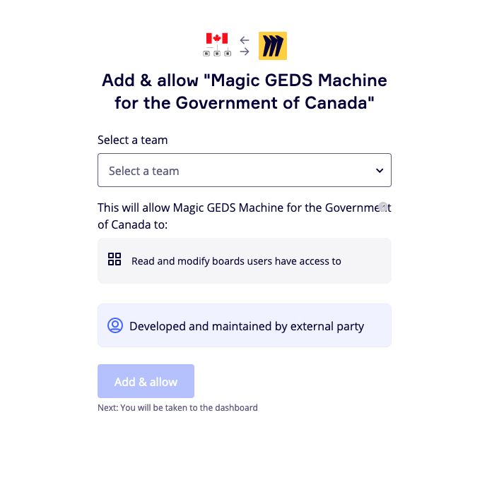
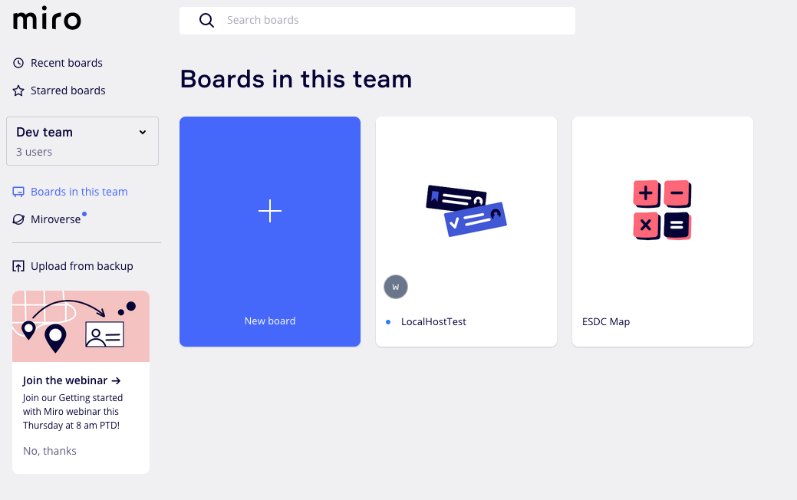
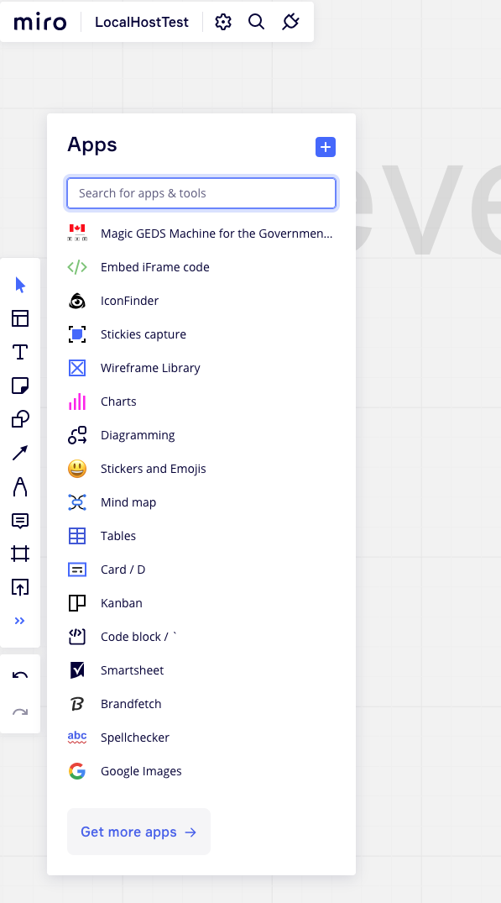
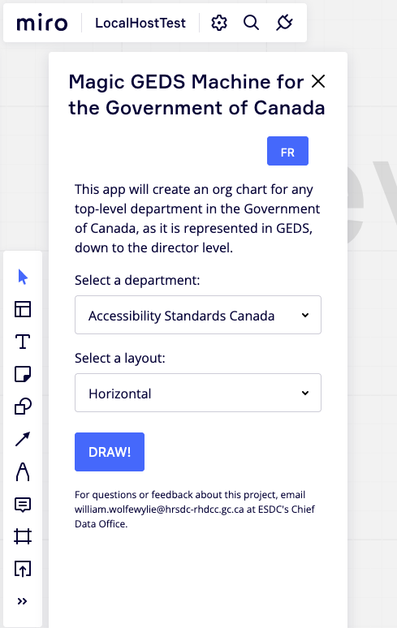
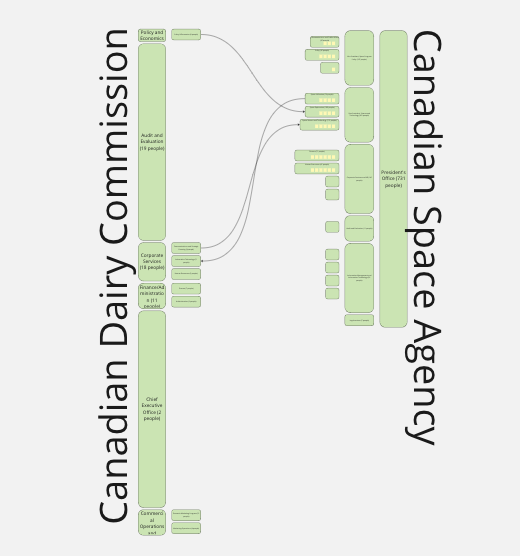

# gov_can-GEDSMACHINE
This takes the open data JSON from GEDS on the Government of Canada Open Data portal and inverts it into a tree of the entire government's structure. Secondly, it integrates with Miro to create a team-by-team visualization of that structure.


### To install the app in Miro
To install the app for your Team in Miro, [CLICK HERE](https://miro.com/oauth/authorize/?response_type=code&client_id=3458764547523651394&redirect_uri=%2Fconfirm-app-install%2F). 



From there, Miro may or may not send you back to your boards. So click the Miro icon in the top-left corner or go directly to [Miro.com](https://www.miro.com).



The app has been installed for all of the boards in your selected team. Note that, by default, Miro will show you all the boards you have access to. Click on the "Boards in this team" button on the left sidebar to show only the boards that have been granted access to the app. Then you may open a Board or create a new Board.

Once you have a board open, the app drawer is on the left-hand toolbar, at the bottom. If you open it, you should see the Magic GEDS Machine listed. 



This will open the Magic GEDS Machine app screen. 



Once you draw a department or two, you can use Miro's built-in features to draw linkages between them to represent consultations, data, financial obligations or anything else your heart desires.



Privacy: The app collects anonymous Google Analytics to track anonymous popularity and usage. No individual or identifiable information is collected or stored. No Miro account information is collected or stored.

### To work on the tool on your own
The GEDS data comes from the open data portal [here](https://api.geds-sage.gc.ca/GEDS20/dist/opendata/gedsOpenDataJson.zip).

That data is not well formed for our needs, though. So the ```data_prep``` directory includes three scripts to make it real:

```geds_transformery.py``` just uses regex to read each person in the Open Data file into a proper list.

```Geds_department_Builder.py``` converts that 750MB JSON file into a more concise 5.5MB JSON file that represents every team in the Government of Canada and its population count.

That script also spits out a json file for each federal department. For this exercise, I'm storing those in a Microsoft OneDrive folder.

```oneDrive_reader.py``` reads that folder and gathers the stable file download links into another json file that we can feed into Miro.

That's the end of the Python portion of this exercise. The rest takes place in the ```miro-app``` directory.

To run locally, you'll need to [create a developer account in Miro](https://developers.miro.com/docs/task-3-run-your-first-app-in-miro) and then:

```npm install```

```npm run start```


